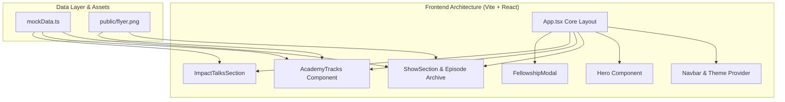

# Product Requirements Document (PRD)
## Niuxverse Solutions — Digital Media & Learning Platform

**Document Status:** Approved & Production-Ready  
**Version:** 1.0.0  
**Author:** Antigravity AI & Niuxverse Engineering Team  
**Date:** September 29, 2026  
**Target Event Launch:** October 4, 2026 (8:30 PM)  

---

## 1. Executive Summary

### 1.1 Vision & Mission
**Niuxverse Solutions** is an AI-first digital media, academy, and community platform dedicated to exploring futuristic technology through the lens of human values, ethics, and creative sovereignty. Guided by the core query **"What makes us HUMAN?"**, the platform bridges technical innovation with philosophical inquiry, empowering creators, developers, and thinkers to build technology that elevates human dignity.

### 1.2 Core Objectives
- **Flagship Event Promotion:** Highlight the premier live broadcast on October 4, 2026, featuring writer Mr. Ifeanyi Nwakpoke, AI Ethics Expert Blessing Egbe, and host Nwaeze David ("The King of Intelligence").
- **Episode Archive & Media Streaming:** Serve an interactive broadcast archive with audio previews, speaker dossiers, and key inquiry notes.
- **Academy Track Enrollment:** Provide structured learning pathways across AI Ethics, Brand Strategy, and Product Design.
- **Community Fellowship:** Drive RSVPs and community engagement via frictionless modal workflows.

---

## 2. Product Strategy & User Personas

### 2.1 Target Audience
1. **Tech Enthusiasts & AI Builders:** Seeking ethical frameworks and philosophical context for emerging AI capabilities.
2. **Designers & Creative Directors:** Looking for brand strategy, UI/UX systems, and human-centered design principles.
3. **AI Ethics & Policy Researchers:** Exploring governance, digital rights, and human sovereignty in an automated age.
4. **Writers & Cultural Thinkers:** Interested in human storytelling, empathy, and relationship dynamics in the digital era.

### 2.2 User Stories
| Persona | Goal | Platform Requirement |
|---|---|---|
| Event Attendee | Register for the "What Makes Us Human?" live stream | One-click RSVP modal with instant confirmation |
| Listener / Viewer | Explore past episode notes and audio excerpts | Filterable Episode Archive with search and expandable dossiers |
| Student | Enroll in the Graphics or Product Design 6-week tracks | Interactive course modal with curriculum breakdowns |
| Visitor | Access brand contact and social handles | Sticky navigation & full footer with website/WhatsApp integration |

---

## 3. System Architecture & Feature Specifications

### 3.1 Hero & Navigation Section
- **Sticky Navbar:** Brand logo, Navigation Links (The Show, Academy, Impact Talks, Founder), Theme Toggle (Light/Dark mode), and Primary RSVP CTA button.
- **Dynamic Hero Banner:** Promotes the October 4, 2026 Flagship Event with event timer countdown, live badges, and direct links to the Luma registration page (`https://lu.ma/59aax3gb`).

### 3.2 The Niuxverse Show (Episode Archive)
- **Grid Layout:** Responsive 3-column episode cards with visual metadata (Episode Number, Category, Duration, Speaker Tags).
- **Search & Category Filtering:** Real-time client-side filter by category (`Human Condition`, `Ethics & Rights`, `Future Trends`, etc.) and search input across titles, hooks, and speaker names.
- **Interactive Audio Excerpts:** Built-in audio playback toggles with animated CSS equalizer waveforms.
- **Expandable Dossiers & Modals:** Clickable cards revealing comprehensive episode overviews, key inquiry points, speaker credentials, and high-resolution event flyers (`/flyer.png`).

### 3.3 Academy Tracks
- **NX-HMN (Special Flagship Track):** "What Makes Us Human?" 4-Week Track covering Consciousness vs Synthetic Intelligence, AI Ethics, Emotional Resilience, and Human-Centered Innovation.
- **NX-DSN (Graphics & Brand Strategy):** 6-Week course on typography, visual identity systems, and pitch deck strategy.
- **NX-PRD (Product Design):** 6-Week course on UI/UX wireframing, component design systems, and clickable prototyping.

### 3.4 Impact Talks & Community Fellowship
- **Live Discussion Panels:** Upcoming interactive Meet sessions with spot reservation tracking.
- **Fellowship Registration Modal:** Unified modal handling general community membership, course enrollment, and live session RSVPs.

---

## 4. UI/UX Design System & Theme Specification

### 4.1 Color Palette
```css
/* Core Palette Tokens */
--color-brand-blue:    #0065E1; /* Primary Brand Blue */
--color-deep-space:    #02102e; /* Dark Mode Background */
--color-neon-green:    #01CF11; /* Accent / Highlight Green */
--color-light-bg:      #f6f8fd; /* Light Mode Background */
--color-card-dark:     #051b44; /* Dark Mode Card Surface */
```

### 4.2 Typography & Aesthetics
- **Font Family:** Clean Sans-Serif (`Inter`, `system-ui`, `-apple-system`).
- **Visual Effects:** Radial backdrop glow effects (`dr-blue-glow`), backdrop blur overlays, and neon accent borders.
- **Responsive Breakpoints:** Mobile (`<640px`), Tablet (`640px - 1024px`), Desktop (`>1024px`).

---

## 5. Technical Stack & Implementation Details



- **Framework:** React 18 with TypeScript (`tsx`).
- **Styling:** Tailwind CSS v4.
- **Icons:** `lucide-react`.
- **Bundler:** Vite 6.4.3.
- **Production Asset Output:** `dist/index.html`, `dist/assets/index-*.css`, `dist/assets/index-*.js`.

---

## 6. Non-Functional Requirements (NFRs)

1. **Performance:** Sub-second page load times; lazy-loaded images with fallback placeholders.
2. **Cross-Platform Compatibility:** Native support across Windows, macOS, iOS, and Android web browsers.
3. **Build Integrity:** Zero TypeScript compilation errors and bundle optimization under 400KB compressed.
4. **Accessibility:** Keyboard navigable modal dialogs, high-contrast text ratios for neon green accents on dark backgrounds.

---

## 7. Release & Deployment Checklist

- [x] Integrate high-resolution event flyer (`/flyer.png`) across all broadcast cards.
- [x] Configure Light / Dark theme persistence.
- [x] Verify production build (`npm run build`).
- [x] Test responsive layouts on mobile and desktop viewports.
- [ ] Connect live backend API / Luma Webhook for automated RSVP ticket generation (v2.0).

---
*End of Product Requirements Document.*
